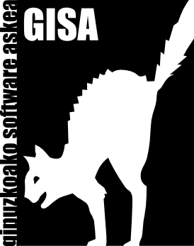

=========
Proiektua
=========

-------------
GISA Elkartea
-------------

.. header::

    | **GISA Elkartea** Proiektua |logo|
    | 943345586 kontaktua@gisa-elkartea.org

.. footer::
    
    |  **IFZ:G20889754** ###Page###/###Total### **Erreg. Zkia: 586194**

Sarrera
=======

GISA Elkartearen helburu nagusia software librea bultzatzea da, jendartean ezagutzera emanez eta bere erabilpena zabaltzeko mota ezberdineko egitasmoak aurrera eramanez. Teknologia libreak ezagutzera emateko ekitaldiak egiten ditugu: Ikastaroak, tailerrak, jardunaldiak, hitzaldiak eta abar. GNU/Linux eta programa libreen gaineko zerbitzuak eskaintzen ditugu, hauek instalatuz, garatuz eta mantentze lanak eginez. Elkarteko kide gehienok software askeko zerbitzuak eskaintzen ditugun profesionalak gara. Elkarteari eskaera bat heltzen zaionean kideen artean lana banatzen dugu. Eskatzen digutena burutzeko gure kideetako inor gai ez bada zerbitzua eskaintzen duten enpresak bilatzen laguntzen dugu. Gure azken helburua software librea alor guztietan egotea da. Elkarteak baita ere bertako kideek proposatutako ekintzak burutzen laguntzen du. Ekintzak aurrera eraman ahal izateko baliabideak eskuragarri uzten ditu: Proiektorea, kableria, ikasgela, Lagunak proiektu kudeatzailea, eta abar.

Webgunearen ezaugarriak
=======================

Oinarrizko Webgunea
-------------------

Aukerazko gehigarriak
---------------------

Zerbitzaria
===========

Ondorengo baldintzak betetzen dituen edozein zerbitzari (webfaction.com erabili ohi dugu):

- Sistema eragile askea.
- >5GB libre disko gogorrean (igo nahi diren argazkien arabera) eta bertako direktorio batean idazteko baimenak.
- 100MB RAM libre.
- Apache2 zerbitzaria instalatuta eta bertan webgune bat gehitzeko aukera. SSL erabiltzeko aukera. Ondorengo moduluak beharrezkoak dira:
- mod_log_config
- mod_rewrite
- mod_wsgi
- mod_alias
- Nginx zerbitzaria instalatuta eta bertan webgune bat gehitzeko aukera.
- Postgresql zerbitzaria instalatuta eta bertan datubase bat gehitzeko aukera.
- SSH bidezko sarrera edozein lekutik.
- Python 2.7 instalatuta.
- Exim edo sendmail instalatuta.
- Procmail instalatuta.
- Domeinua
- MX eta A edo NS erregistroak aldatzea baimentzen duen edozein domeinu erregistratzaile (internet.bs erabili ohi dugu).

METODOLOGIA
===========

1. Webgunearen helburuak eta beharrak zehaztea.
2. Proposamen baten aurkezpena.
3. Hasierako garatzea.
4. Egindakoaren aurkezpena eta beharrezko aldaketen identifikazioa.
5. Garatze definitiboa.
6. Zerbitzarira igotzea.
7. Guztia martxan jartzea.

Gure proiektu kudeatzaileari ezker, prozesu guztiaren jarraipena egitea posible da. Horrela, gure lan erritmoa ikustea, aurkitzen ditugun arazoak behatzea, ematen ditugun pausoak jarraitzea eta intzidentzien berri ematea posiblea da. Horretarako http://github.com/GISAElkartea/proiektua helbidera sartzearekin nahikoa da.

AURREKONTUA
===========

========================================    ====
Oinarrizko webgunea*
========================================    ====
Diseinua                                    
Maketazioa                                  
Garapena                                    
Zerbitzarian instalatzea                    
**GUZTIRA**                                     
========================================    ====

========================================    ====
Aukerazko gehigarriak*
========================================    ====
========================================    ====

========================================    ====
Mantenimendu bonoak*
========================================    ====
Martxan dagoenetik lehen bi hileak          Doan
10 orduko mantenimendu bonoa                400€
========================================    ====

\*Prezio guztiak BEZ-ik gabe daude
